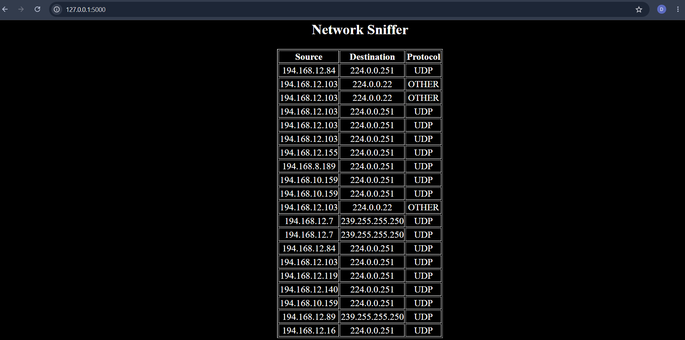

## **🚀 Network Sniffer Project**

## **📌 Project Overview**
The **Network Sniffer** is a Python-based application that monitors and captures network traffic in real-time. It helps users analyze packets flowing through a network and understand how data is transmitted.

This project is useful for:
- Learning networking concepts  
- Understanding packet structure  
- Monitoring network activity  
- Basic cybersecurity awareness  

---

## **✨ Features**
✔ Real-time packet capturing  
✔ Displays source and destination IP  
✔ Shows protocol details (TCP, UDP, ICMP)  
✔ Lightweight and beginner-friendly  
✔ Web interface using Flask  

---

## **🛠️ Tech Stack**
- Python  
- Flask  
- HTML  
- CSS  
- JavaScript  
- Scapy (for packet sniffing)  

---

## **📁 Project Structure**
```
network_sniffer/
│── templates/
│   ├── index.html
│
│── screenshot/
│   ├── result.png
│
│── app.py
│── README.md
```

---

## **📸 Screenshots**

### **🔹 Output View**


---

## **🚀 How to Run the Project**

### **1️⃣ Clone the Repository**
```
https://github.com/Deepika-2709/Network_sniffer.git
```

### **2️⃣ Navigate to Folder**
```
cd network_sniffer
```

### **4️⃣ Run the Application**
```
python app.py
```

---

### **5️⃣ Open in Browser**
```
http://127.0.0.1:5000
```

---

## **⚠️ Important Note**
- Run terminal as **Administrator** (required for packet sniffing)  
- Works best on local network  
- Use only for educational purposes  

---

## **🎯 Purpose**
This project demonstrates how network packets can be captured and analyzed, helping users understand real-world networking and cybersecurity basics.

---

## **📈 Future Improvements**
- Add packet filtering options  
- Save captured data to file  
- Improve UI dashboard  
- Add graphical analytics  

---

## **🤝 Contributing**
Contributions are welcome!  
Feel free to fork this repository and submit pull requests.

---

## **⭐ Support**
If you like this project, give it a ⭐ on GitHub!

---

## **👩‍💻 Author**
Deepika Vallavan
